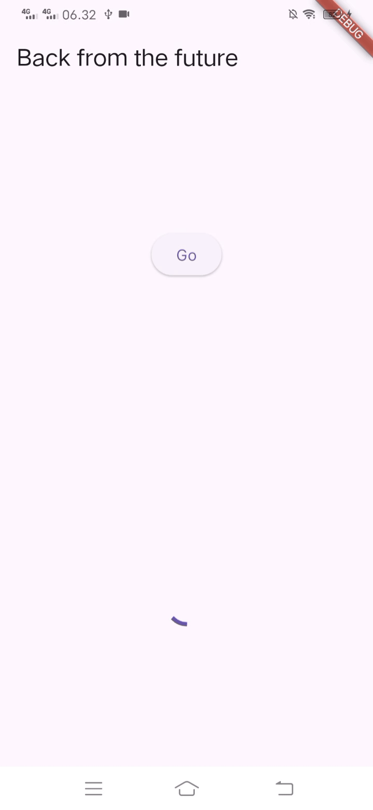
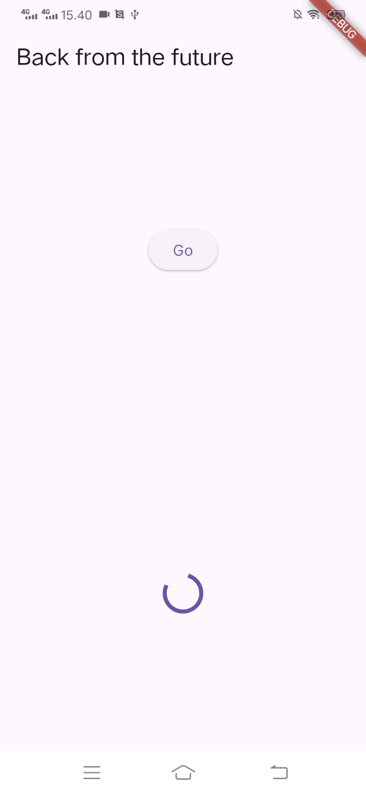
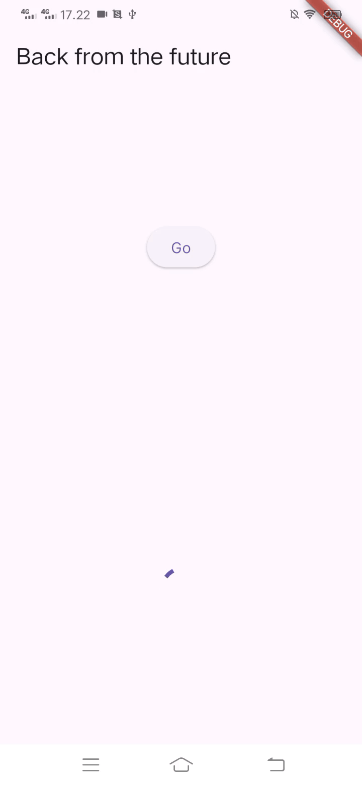

# Books

M Juan Adi Pratama - 1122140109  
Flutter project yang menjalankan operasi asyncronous dan integrasi API.

## Laporan Praktikum

### Soal no 1
menambahkan nama panggilan pada title app sebagai identitas hasil pekerjaaan.

```dart
  Widget build(BuildContext context) {
    return MaterialApp(
      title: 'Juan',
      theme: ThemeData(
        primarySwatch: Colors.blue,
        visualDensity: VisualDensity.adaptivePlatformDensity,
      ),
      home: const FuturePage(),
    );
  }
```

### Soal no 2

Implementasi pencarian buku menggunakan Google Books API.
[Lihat contoh buku Mantappu Jiwa](https://www.google.co.id/books/edition/Mantappu_Jiwa_Buku_Latihan_Soal/TzCyDwAAQBAJ)


### Soal no 3

```dart
    onPressed: () {
        setState(() {});
        getData()
        .then((value) {
            result = value.body.toString().substring(0, 450);
            setState(() {});
        })
        .catchError((_) {
            result = 'An error occured';
            setState(() {});
        });
    },
```

#### Penjelasan:

- **Substring**: Untuk mengambil 450 karakter dari awal respons.
- **Catch Error**: Untuk menangkap jika terjadi error pada pemanggilan data.
- **Set State**: Untuk memperbarui UI.

#### Demo



### Soal no 4

#### Langkah 1

```dart
Future<int> returnOneAsync() async {
    await Future.delayed(const Duration(seconds: 3));
    return 1;
  }

Future<int> returnTwoAsync() async {
    await Future.delayed(const Duration(seconds: 3));
    return 2;
  }

Future<int> returnThreeAsync() async {
    await Future.delayed(const Duration(seconds: 3));
    return 3;
  }
```

#### Langkah 2

```dart
Future count() async {
    int total = 0;
    total = await returnOneAsync();
    total += await returnTwoAsync();
    total += await returnThreeAsync();
    setState(() {
      result = total.toString();
    });
  }
```

#### Penjelasan:

- **Fungsi returnOneAsync()**: Untuk mengembalikan nilai 1 setelah 3 detik.
- **Fungsi returnTwoAsync()**: Untuk mengembalikan nilai 2 setelah 3 detik.
- **Fungsi returnThreeAsync()**: Untuk mengembalikan nilai 3 setelah 3 detik.
- **Fungsi count() async**:  Untuk menghitung total dari ketiga angka tersebut, Setelah total dihitung hasilnya diubah menjadi teks dan ditampilkan di UI menggunakan setState(), jadi total waktu proses 9 detik.

#### Demo


### Soal no 5

#### Langkah 2

```dart
  late Completer completer;

  Future getNumber() {
    completer = Completer<int>();
    calculate();
    return completer.future;
  }

  Future calculate() async {
    await Future.delayed(const Duration(seconds: 5));
    completer.complete(42);
  }
```

#### Penjelasan:

- **late Completer**: Menggunakan late karena akan diinisialisasi nanti. Completer untuk mengontrol penyelesaian dari Future secara manual.
- **getNumber()**: Membuat objek integer untuk menangkap hasil yang akan diterima, memanggil fungsi calculate untuk memulai proses perhitungan, mengembalikan future yang akan diselesaikan setelah proses selesai.
- **calculate()**: Menunggu 5 detik menggunakan Future.delayed(), setelah itu completer.complete(42) diaktifkan, yang berarti future di dalam getNumber() selesai dan menghasilkan angka 42.

#### Demo



### Soal no 6

#### Langkah 5 dan 6

```dart
  calculate2() async {
    try {
      await new Future.delayed(const Duration(seconds: 5));
      completer.complete(42);
    } catch (_) {
      completer.completeError({});
    }
  }

  getNumber()
    .then((value) {
        setState(() {
            result = value.toString();
        });
    })
    .catchError((e) {
        result = 'An error occured';
    });
```

#### Penjelasan:

- **Perbedaan**:

1. Penanganan Error

    - Sebelumnya: Tidak ada penanganan error
    - Sekarang: Menggunakan try-catch untuk menangkap error yang mungkin terjadi

2. Complete Error

    - Sebelumnya: Hanya bisa menyelesaikan dengan hasil yang sukses, seperti completer.complete(42).
    - Sekarang: Selain menyelesaikan dengan hasil sukses, juga bisa menyelesaikan dengan error menggunakan completer.completeError().

    - **Fungsi getNumber()**: jika terjadi kesalahan di fungsi calculate(), error tersebut akan diteruskan (propagate) dan ditangkap. Jika ada error, pesan kesalahan akan ditampilkan di antarmuka pengguna (UI).

#### Demo


### Soal no 7

#### Demo


### Soal no 8

#### Perbedaaan Langkah 1 & 4

```dart
    // Langkah 1
    FutureGroup<int> futureGroup = FutureGroup<int>();
    futureGroup.add(returnOneAsync());
    futureGroup.add(returnTwoAsync());
    futureGroup.add(returnThreeAsync());
    futureGroup.close();
    futureGroup.future.then((List<int> value) {
      int total = 0;
      for (var element in value) {
        total += element;
      }
      setState(() {
        result = total.toString();
      });
    });

    // Langkah 4
    final futures = Future.wait<int>([
      returnOneAsync(),
      returnTwoAsync(),
      returnThreeAsync(),
    ]);
```

#### Penjelasan:

- **Perbedaan**:

1. Fleksibilitas:

- FutureGroup: Bisa menambah Future secara dinamis
- Future.wait: Future harus ditentukan saat deklarasi

2. Sintaks:

- FutureGroup: Perlu inisialisasi, penambahan, dan penutupan
- Future.wait: Lebih ringkas dengan satu baris code

### Soal no 9

#### Demo



### Soal no 10

#### Hasil running

- Ketika tombol "Go" diklik:

1. Akan menunggu delay 2 detik
2. Menampilkan pesan error: "Exception: Something terrible happened!"
3. Mencetak complete di console

#### Perbedaan langkah  1 dan 4

**Langkah 1: returnError()**

```dart
  Future returnError() async {
    await Future.delayed(const Duration(seconds: 2));
    throw Exception('Something terrible happened!');
  }
```

- Hanya membuat Future yang akan throw exception
- Tidak ada penanganan error

**Langkah 4: handleError()**

```dart
  Future handleError() async {
    try {
      await returnError();
    } catch (error) {
      setState(() {
        result = error.toString();
      });
    } finally {
      print('Complete');
    }
  }
```

- Menangkap error dari returnError() menggunakan try-catch
- Menampilkan pesan error ke UI menggunakan setState
- Memiliki block finally yang akan selalu dieksekusi

### Soal no 11
Menambahkan nama panggilan tiap properti title sebagai identitas pekerjaan.

```dart
  @override
  Widget build(BuildContext context) {
    return Scaffold(
      appBar: AppBar(title: const Text('Current Position Juan')),
      body: Center(
        child: Text(myPosition),
        ),
    );
  }
```

### Soal no 12

```dart
// Menambahkan delay 3 detik untuk loading
  await Future.delayed(const Duration(seconds: 3));
```

- Apakah anda mendapatkan koordinat GPS ketika run di browser? Mengapa demikian?

Iyaa, koordinat GPS didapatkan ketika menjalankan aplikasi di browser karena beberapa alasan :

1. Package Geolocator Web Support

- Package geolocator sebenarnya memiliki dukungan web melalui plugin geolocator web
- Plugin ini secara otomatis menggunakan HTML5 Geolocation API ketika dijalankan di browser

2. Browser Permission

- Browser mendukung HTML5 Geolocation API
- Ketika aplikasi meminta akses lokasi, browser akan menampilkan pesan permission ke user, jika user mengizinkan koordinat GPS bisa didapatkan

#### Demo


### Soal no 13

- Apakah ada perbedaan UI dengan praktikum sebelumnya? mengapa demikian?

Iyaa, ada sedikit perbedaan UI dengan praktikum sebelumnya karena beberapa faktor :

1. Struktur widget yang berbeda

```dart
// Praktikum Sebelumnya
final myWidget = myPosition == ''
    ? const CircularProgressIndicator()
    : Text(myPosition);

// Praktikum Sekarang
child: FutureBuilder(
  future: position,
  builder: (BuildContext context, AsyncSnapshot<Position> snapshot) {
    if (snapshot.connectionState == ConnectionState.waiting) {
      return const CircularProgressIndicator();
    } else if (snapshot.connectionState == ConnectionState.done) {
      return Text(snapshot.data.toString());
    } else {
      return const Text('');
    }
  }),
```

2. Perbedaan Pendekatan

- Sebelumnya menggunakan variabel myPosition untuk menentukan tampilan
- Sekarang menggunakan FutureBuilder yang langsung mengelola state dari Future

3. Alasan Perbedaan

- FutureBuilder lebih tepat untuk menangani async operations
- Memberikan kontrol lebih baik atas state loading
- Tidak perlu manual update variabel myPosition

4. Keuntungan Menggunakkan FutureBuilder

- Otomatis menangani state loading
- Build in error handling
- Reactive terhadap perubahan Future

#### Demo


### Soal no 14

Apakah ada perbedaan UI dengan langkah sebelumnya? mengapa demikian?

Tidak ada perubahan UI jika tidak ada error, mengapa tidak ada perubahan :

1. Tampilan normal

- Jika tidak ada error, tidak ada perbedaan UI dan tetap menampilkan koordinat lokasi

2. Tampilan error

- Sebelumnya menampilkan error system, sekarang menampilkan pesan error "Something terrible happened!"
- Menangani error dengan baik dan memberikan feedback yang jelas ke user

#### Demo


### Soal no 15

Menambahkan nama panggilan anda pada tiap properti title di class NavigationFirst sebagai identitas pekerjaan

```dart
  appBar: AppBar(
    title: const Text('Navigation First Screen Juan')
  ),
```

Mengganti dengan warna favorit
```dart
  Color color = Colors.cyan.shade700;
```

### Soal no 16

Cobalah klik setiap button, apa yang terjadi? mengapa demikian?

Yang terjadi saat klik button :

1. First Screen Button (change color)

- Saat di klik, navigasi ke halaman kedua
- Background screen pertama masih terlihat di belakang
- Menggunakan navigator.push()

2. Second Screen Button

- Setiap button warna ketika di klik akan mengubah warna background First Screen lalu menutup Second Screen dan kembali ke First Screen dengan warna baru

Mengapa bisa begitu?

```dart
  Future _navigateAndGetColor(BuildContext context) async {
    color =
        await Navigator.push(
          context,
          MaterialPageRoute(builder: (context) => const NavigationSecond()),
        ) ??
        Colors.blue;
        setState(() {
          
        });
  }
```

1. Mekanisme Navigasi

- Navigator.push() menambah route baru ke stack
- await menunggu nilai return dari Second Screen
- setState() memperbarui UI dengan warna baru

2. Data Passing

- Warna dipilih di Second Screen
- Dikirim kembali ke First Screen menggunakan Navigator.pop(color)
- First Screen menerima dan mengupdate state

Berikut untuk mengganti 3 warna dengan warna favorit pada langkah ke 5 :

```dart
  children: [
    ElevatedButton(
      child: const Text('Red'),
      onPressed: () {
        color = Colors.red.shade700;
        Navigator.pop(context, color);
      }),
    ElevatedButton(
      child: const Text('Green'),
      onPressed: () {
        color = Colors.green.shade700;
        Navigator.pop(context, color);
      }),
    ElevatedButton(
      child: const Text('Blue'),
      onPressed: () {
        color = Colors.blue.shade700;
        Navigator.pop(context, color);
      }),
  ],
```

#### Demo

